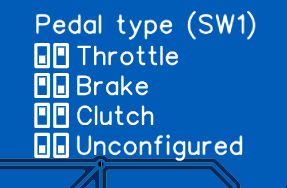

# ESP32-S3 control board

## Background
I started building a Sim Racing pedal for my rig with a friend and realized fairly quickly that we wanted a PCB design different to the one that's part of the project. My main reasons for this are:
- Something more compact than the one included in the main hardware repository
- I also wanted to rely less on hobbyist parts (dev boards) and have something more built-for-purpose
- We wanted to to use USB-HID and something based on the ESP32-S3 allowed this (the ESP32 doesn't have native USB support)

Initially, the board was based on the ESP32-S3-WROOM module that Espressif offers. This is nice because it's already certified for commercial use, but it has one major downside - it requires the use of specially controlled temperatures during assembly. This can make it expensive to build, because you can't use economy PCBA services. Of course, if you're going to assemble these boards at home that doesn't matter but some SMT parts are not for the feint of heart - especially the smaller ones. Now it's based on the ESP32-S3 chip with 128Mb of SPI-flash, which mimics the ESP32-S3-WROOM(N16) module.

 

## Features
- Tiny size! It's just over 2" square (51mm x 51mm)
- ESP32-S3 based, so you can get USB-HID support out of the box and won't need to use Bluetooth or additional boards*
- Dedicated connections for loadcell, servo serial, servo signal, an emergency cut-off button
- DIP switches to select the pedal type when using the wireless bridge (Accelerator, Brake or Clutch)
- All headers are 2.54mm, meaning you can connect 'normal' pin headers, JST-XH connectors or just solder straight to the board, use screw terminals or use any other 2.54mm pitch connector
- Fully compatible with mainline release builds, you don't need any special firmware builds to use this PCB
- If you want to use Bluetooth or Wifi an u.fl/IPEX connector is included for an external antenna (useful if you pedal is aluminum)
- USB-B connector for power and data (the ESP32-S3 can also be flashed with this interface)
- If you're going totally wireless, the board can be powered directly from the 5V header without a USB cable plugged in.

*As of the time of writing, USB-HID support is experimental and may be unreliable. This board also has a IPEX header for wireless communication to the wireless setup or you can use Bluetooth or vJoy.

## A quick note on connectors
The board will ship without connectors installed - this reduces to the cost of the board (otherwise you need to pay a human at JLCPCB to install them) but also allows you to use whatever connector type you like, or solder straight to the board. This means that while the board comes assembled, you will need a soldering iron (or a friend with one) to be able to finish the board.

## Assign a function
Before you begin, you must assign a function to the pedal: throttle, brake or clutch. This is done with SW1. You will find instructions on the back of the board but they're here for reference:

## Flashing the board
Flashing the board is largely the same as any other device, but there are a few quirks. So read before flashing!
1. Start with the board unplugged
2. Check the names of the serial ports on your PC (if any)
3. While holding down the "Flash" button ("Boot" on older boards), plug the board in to your PC
4. A new serial port (COM port) will appear on your PC, note which one it is
5. Now you can follow the instuctions from the main Wiki, just make sure you flash the `-gilphilbert` flash image
6. When you've flashed all the images (with the correct offsets!) press reset, or simply unplug the board from your PC and plug it back in
